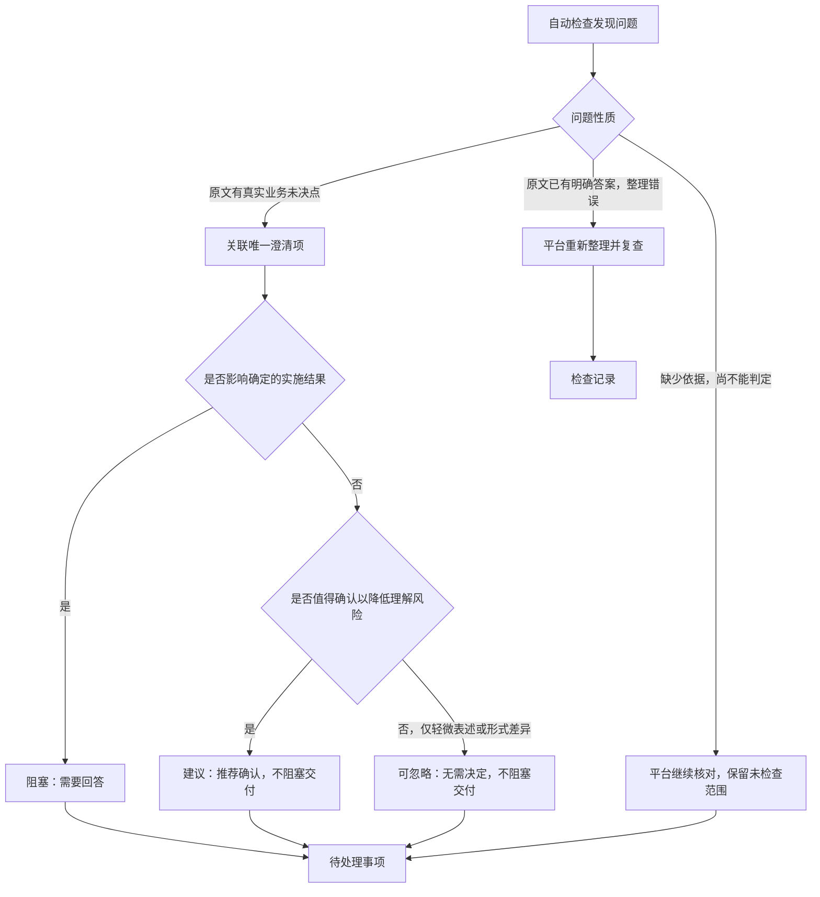

# 定版 PRD 的问题处理与可读展示

日期：2026-09-11。状态：分析与建议方案，尚未实施。

## 1. 目标与范围

平台接收已定版 PRD，整理后的需求将直接交给开发 Agent。用户进入结果页，首先需要知道能否交付、哪些事项必须回答、哪些可以暂不处理，以及答案会影响什么业务行为。

本轮分析展示、澄清生成、分级、自动检查和回答闭环；不修改业务代码，不执行真实项目开发。本文件是新的方案快照，不回写既有方案，也不修改当前未跟踪的其他方案文件。

## 2. 当前事实与问题根因

### 2.1 本地真实任务

只读检查本地保存的 `T-61E0C5FB`，项目为“PRD-同名生产活动关联ID合并提醒_0826”。数据来源为本机 `%APPDATA%/prd-refinement-desktop/analysis-tasks/T-61E0C5FB.json`。

- 任务状态 completed，旧流程 pipelineVersion=3，28 条需求、60 条开放澄清、110 条审查记录，其中 100 条未修复。
- 60 条澄清中，55 条的 question 完全相同：`请人工确认该原文应如何整理为需求明细。` 其原因是自动修正失败并带大量内部来源编号，不能算作 55 个真实业务问题。
- Q-0004、Q-0005、Q-0006 分别是一个断句、`NULL`、`统一处理。`；实际来自同一段“字段空值”说明。
- Q-0001 也在询问空字符串、纯空格是否按空值处理，与上述碎片需要按同一业务决策归并。
- Q-0002 把按钮最终文案和是否直接生成版本混在一起询问；业务动作与文案应分别核对，不能由按钮名称直接推断真实动作冲突。

以该任务的副本启动独立 Electron profile，读取当前构建的页面并截图，确认原始长编号、碎片问题、通用失败问句确实出现在页面；未操作用户正在使用的任务或触发重新分析。临时截图位于 `docs/tmp/clarification-review-analysis/questions.png`、`audit.png`。澄清页采用四列长卡片，长编号和重复诊断把业务问题挤到次要位置；审查页大段文字居中，也不利于逐项处理。

此证据证明旧任务数据与当前展示路径的问题，不证明当前 v4 新分析仍会生成同样的 55 条失败澄清。v4 已将模型输出失败改为平台问题；以下仍存缺口有当前源码依据。

### 2.2 当前源码

| 事实 | 当前证据 | 用户后果 |
|---|---|---|
| 内容索引和原文抽屉直接显示来源内部 ID | `src/MaterialWorkspace.tsx:96`、`:99` | 看见文件身份、解析版本等机器标识，难以认出业务内容 |
| 澄清影响对象只尝试把 R ID 换成标题，F/S ID 直接回显 | `src/App.tsx:45` | 大量长编号进入主阅读区域 |
| 审查页直接显示 owner、affectedIds 和模型 detail | `src/App.tsx:46` | 责任节点、字段名和诊断语气被当作业务说明 |
| 来源抽屉直接展示模型用 context | `src/App.tsx:47` | 结构标记和章节中的内部编号也会泄漏到页面 |
| 功能清单仅有编号、类型、原文数量、需求数量 | `src/App.tsx:42` | 用户无法辨认两个功能的区别 |
| 非 needs-clarification 的需求一律显示“待人工审阅”，抽屉也固定这样显示 | `src/App.tsx:43`、`:47` | 即使已经检查通过，也像还有一道必须逐项完成的审批 |
| Clarification 只有 question/reason/affectedIds/state 等字段，没有影响级别、决策选项和业务后果 | `src/types.ts:93` | 描述完整性和轻重分级没有数据支撑 |
| 当前校验只要求问题文本、理由及引用合法 | `electron/domain.ts:208` | `NULL` 或半句话也可能结构合法 |
| HTML 每个文本节点独立成为来源，行内元素可打断句子 | `electron/document-assets.ts:149` | 一段文字可被拆成多个来源碎片 |
| 无所属功能的 clarification 来源直接复制成一条问题 | `electron/scheduler-v2.ts:376` | 来源块与业务问题被错误地一对一对应；v4 仍存在 |
| source-ambiguity 审查仅标为 needs-confirmation | `electron/scheduler-v2.ts:503` | 没有落成唯一澄清项的完整闭环 |
| Q/A 互链字段已声明，但未见业务代码写入或消费 | `src/types.ts:38`、`:99`；搜索 electron/src 中对应字段 | 既有方案要求的唯一问题关联尚未完成 |
| 所有开放澄清、所有未处理审查都会阻断；audit.passed 同样要求清零 | `electron/scheduler-v2.ts:110`、`:504` | 仅在 UI 增加“可忽略”标签并不能解除非阻塞事项 |

既有 `docs/spec/final-prd-agent-handoff.md:168` 已要求 Q/A 互链和业务/平台责任分离；问题关联验收 A10 仍为 PENDING。不能把前一轮整体测试通过当作此能力完成的证据。

## 3. 方案比较与选择

| 候选方案 | 价值 | 决策 |
|---|---|---|
| 只隐藏 ID、翻译术语 | 能快速减轻阅读噪声 | 不足：碎片问题、重复问法、所有问题都阻塞仍存在 |
| 把全部审查和澄清合并成一张待回答清单 | 只有一个入口 | 不采用：把平台遗漏和运行失败继续转交给用户裁决 |
| 一个待处理入口，按责任和交付影响组织，保留自动检查记录 | 用户只处理需要自己决策的事项，也看得见平台阻塞 | 推荐：展示统一，责任和状态仍准确分开 |

沿用当前中文桌面工作台视觉体系，重点调整信息层级和处理流程，不进行品牌或配色重做。

## 4. 页面结构与术语

结果页主入口调整为：`概览｜功能与需求｜待处理事项｜交付文件`。自动检查记录从概览的“查看检查记录”进入次级视图；来源从相关问题或需求打开。

概览先显示“当前能否交付 + 原因 + 下一步”。例如以下数字仅为布局示意：

```text
暂不能交付：1 项业务问题待澄清，2 项内容正在重新整理
另有 1 项建议、2 项可忽略事项，均不阻塞交付

[处理阻塞事项]    [查看整理草稿]
```

全部必要检查通过且只剩建议、可忽略事项时，显示“可以交付，另有 1 项建议、2 项可忽略事项”，主动作是“打开交付包”。两类事项均无需逐项确认或点击忽略后才能交付。

待处理页使用左侧单列问题列表、右侧详情；窄窗口改为列表进入详情并能返回原位置。取消多列长卡片和审查正文居中。列表只显示：级别、完整问题标题、影响的功能、处理状态、处理方。正文、证据、选项在详情展开。

同一页面可筛选“需要你澄清”“平台整理问题”“已处理”，级别使用“阻塞、建议、可忽略”三个标签并分别计数。默认依次展示阻塞、建议，可忽略事项折叠但保留数量和展开入口。业务与平台事项分别标明责任，不把平台修复按钮和用户回答按钮混为一谈。

### 4.1 不再暴露机器语言

| 现有内容 | 默认展示 |
|---|---|
| S-文件UUID-v1-bundle-…、sourceUnitId | 文件名 + 实际章节/位置 + 原文摘录；独立“查看原文”动作 |
| F-001 + 3 处原文 | 来源章节标题/所选原句 + 需求数量；功能编号降为次级 |
| 影响 F/S/R ID 列表 | 可点击的业务标题；未归属需求时显示原文标题与选区 |
| source-decision / requirement-detail / runtime-output | 需要你澄清 / 平台重新整理 / 分析未完成 |
| detail/behavior/constraints/evidenceBindings 等内部字段名 | 整理后的要求 / 条件与限制 / 原文依据 |
| 待人工审阅 | 根据真实检查结果显示“检查通过”“有待澄清项”“整理待修正”“尚未检查” |

功能标题只取已有来源标题或精确选区的原句，不重新让模型生成名称、目标和摘要。标题宽泛或重复时增加能区分的选区摘录；没有合适标题就显示原句。短编号可用于定位和反馈，但不承担业务名称。

来源展示统一从文件、章节、位置、选区等结构化数据生成，不直接显示模型提示用 context，也不靠到处替换 ID 字符串修补界面。缺少可靠章节/页码时显示真实可用位置，不编造页码；多文件来源分别展示。结构未提供章节时，应先完善解析元信息。

隐藏的是平台内部标识。PRD 明确规定的字段如 `tw_processes.uuid`、业务值 `NULL`、接口路径仍须在相关业务正文中准确保留。

## 5. 澄清分级与质量规则

### 5.1 三级：阻塞、建议、可忽略

| 级别 | 判定 | 对交付的影响 |
|---|---|---|
| 阻塞 | 不回答会迫使 Agent 猜测业务行为、数据判定、权限、状态或验收口径；不同答案导致不同实施结果 | 必须处理并验证，未确认前只提供草稿；准确列出影响需求和原因 |
| 建议 | 已有明确依据可实施，但原文仍存在值得确认的表达差异或理解风险；不处理时仍有确定的执行口径 | 推荐确认，可暂不处理，不阻塞交付；必须说明沿用的依据和不处理的影响 |
| 可忽略 | 仅涉及轻微表述或文档形式，不改变业务含义、实施结果或验收，也不需要用户作决定 | 默认折叠，可直接忽略，不阻塞交付；记录可查 |

“建议”和“可忽略”都是非阻塞级别，但处理价值不同：建议值得用户查看和确认，可忽略通常无需投入处理时间。界面统一使用用户指定的三级名称，不把后两级合并成“非阻塞”。

建议项不能成为新增功能、优化设计或技术方案的入口，只针对定版 PRD 本身的表达和交付理解。尚未采纳的建议不能写入确定需求，Agent 按已明确的原文依据实施。纯技术选型缺失不生成问题；重复问题应合并，有证据排除的误报进入检查记录，不能充当可忽略项凑数。

“可忽略”是级别，“本轮忽略”是用户操作。忽略只改变个人处理状态，不等于问题已回答、不等于采纳系统建议，也不授权 Agent 自行改变业务。

级别与处理状态独立。阻塞项不得靠点忽略直接通过。用户提供能改变判定的事实、明确处置或范围调整时，进入新的输入并重新检查；不能单靠修改标签降低级别。

无法说明“不回答的后果”或无法判定级别时，先进入平台复核，不伪装成已确认的阻塞业务问题；相关范围保持未检查。没有指定内部函数名、实现框架等事项原则上不生成澄清；PRD 明确要求某项技术评审结论且该结论决定业务结果时仍需处理。

### 5.2 一条澄清必须让用户能够作答

阻塞项及需要用户确认的建议项应包含以下内容；可忽略项展示完整事项说明、原文依据和为何可忽略，不强制改写成问句或要求回答：

1. 完整问题：写清业务对象、触发条件、待决定的规则，不能使用无指代的“上述”“该内容”。
2. 已知事实：原文已经明确哪些行为，避免让用户重答已定版内容。
3. 未决点：到底缺哪一个决定，或哪两处要求互相冲突。
4. 原文依据：可打开的文件与位置；冲突展示双方原文。
5. 不回答的影响：会让 Agent 无法决定什么；影响哪些需求。
6. 级别及其理由：不能仅因出现“未明确”就标成阻塞。
7. 回答方式：有依据的候选口径及后果，另有自由输入；没有依据时不凭空凑选项，不预选业务答案。

缺口结论还须检查相关上下文、表头、引用资料及明确的版本优先级，避免仅因当前片段没答案就提问。只有标题完整或 JSON 合法不代表问题成立。

### 5.3 真实任务改写示例

原 Q-0001/Q-0004/Q-0005/Q-0006 对应同一空值决策，建议归并为：

> **阻塞：同名生产活动的合并判定，是否将空字符串和纯空格按 NULL 处理？**
>
> 已明确：同一判定字段两边均为 NULL 时视为相同；一边为空、一边非空时视为不同；非空值按原始存储值比较。
>
> 待确认：PRD 要求开发前核实判定字段中的空字符串、纯空格，并确认是否统一按空值处理，目前缺少这项结论。
>
> 影响：不同口径可能改变完整键比较和哪些数据组可以合并，Agent 不能自行选定。
>
> 依据：主 PRD“5.1 核心规则”“7. 约束与风险”，点击可查看完整段落和判定字段表。
>
> 待填写：相关数据核实结论，以及按空值统一处理或按原始值区分处理的最终口径。技术负责人依据原文要求提供结论；不由本平台查询业务库或代作技术评审。

原 Q-0002 应先核对原型交互、正文和版本范围。不能把“确认合并生成版本”的文案直接推断成“该按钮实际直接生成版本”：

- 如果只是文案不一致，且正文/有效交互已唯一明确“完成合并后打开独立确认弹窗”，可形成“建议：确认合并按钮文案与流程描述一致”，并说明交付仍保留已明确的业务动作；未确认的新文案不写入确定要求。如果按钮文案本身属于尚无唯一口径的强制验收内容，不能仅因动作明确就降为建议。
- 如果有效来源确实分别规定“直接生成”和“再次确认”，问题改为“确认合并后，是否还需要单独确认生成版本？”，标为阻塞并展示双方依据。
- 可忽略的示例是同一业务名称存在不影响识别的空格或标点差异，且不涉及要求逐字一致的字段、接口、文案或验收内容。这是分级示例，不声称已在该任务中发现此项。
- 如果原型所属章节或版本无法确定，先由平台复核来源。本轮没有完整核验其交互与版本，不裁定 Q-0002 的最终级别。

原 55 条“请人工确认如何整理”的问题应归为平台整理失败记录。需要根据失败范围关联受影响内容，展示重试/重新分析入口，不能当作 55 项业务问题，也不能仅删掉后宣告可交付。

## 6. “需求评审”与“待澄清”的关系

当前容易混淆的概念有三个：

- **自动需求检查**：平台核对整理内容是否遗漏、误读、无依据新增。这是当前“需求审查问题”的主要来源。
- **业务澄清**：PRD 中确有会影响实施结果的冲突或缺口，需要用户提供决定。
- **人工需求评审**：组织中的审批/评审活动；平台当前并没有一套完整的逐条评审操作和记录，不应通过“待人工审阅”标签暗示必须再审批。

原 PRD 写到的“技术评审”是原需求的一项明确前置要求，要保留其事实和结论；它不等于平台自动检查，也不能一律当作可忽略的技术实现细节。

自动检查是发现问题的过程，澄清是部分问题的处理方式。保留内部对象分工，用户只看统一的待处理事项：



多个审查发现可以指向同一个澄清。计数、列表、回答状态以唯一澄清为准；检查记录只链接它，不再维护第二份问题文案或关闭状态。平台尚未修好的内容问题也显示在同一入口，但处理方必须是平台。

## 7. 生成与闭环如何落地

### 7.1 先解决来源碎片，再规范问题

保留现有来源身份用于追溯，增加供阅读和分析使用的语义上下文：同一段落、列表项、表格行及其表头形成完整阅读范围，行内 `code/strong/span` 不把业务句子截断。HTML 内嵌文档的章节作用域不能污染主文档。阅读范围保留每个原始引用的映射，不按相邻编号直接拼接跨段落内容。

`sourceDispositions.kind=clarification` 只表示该来源承载待确认内容，不代表必须每个来源生成一条问题。无所属功能的澄清也进入同一“完整上下文 → 判断问题 → 规范问句 → 关联来源”的路径，不再逐字复制来源碎片补问题。

去重依据是业务对象、条件、待决定规则及证据范围。不能只按相似问句、共享来源或同一功能合并；一个来源可以包含两个独立决策，同一决策也可能在多个章节重复出现。

### 7.2 复用数据与执行路径

- 继续使用 Clarification 与 AuditIssue，不新增第三套问题账本。
- Clarification 补充固定三级 `blocking / suggestion / ignorable`（界面为“阻塞 / 建议 / 可忽略”）、级别依据、业务上下文、明确的未决点、影响说明、直接来源选区，以及有依据的候选答案和处理记录。建议项必须明确不处理时沿用的原文依据；可忽略项没有待决定事项时不强制生成问题或答案选项。
- 用已有 `AuditIssue.clarificationId` 与 `Clarification.auditIssueIds` 实际建立多对一关联；生命周期由澄清记录驱动。
- 分离审查执行完成情况与交付判定，修正 `audit.passed` 和 `assessDelivery` 两处全量清零逻辑。不能只改页面标签。
- 内部 ID、来源身份和哈希保留在机器数据与诊断详情；页面、Excel、Markdown 共享一套标题/位置/状态转换，防止网页易读而导出继续暴露长编号。
- 内部状态字段允许区分待回答、回答待验证、已解决、有证据排除、本轮忽略；默认界面只呈现当前处理状态，保留记录可查。

### 7.3 回答必须真的影响下一次交付

用户在问题详情填写答案后可以保存；保存不等于解决。复用“继续完善”的拟定路径，答案关联原问题、问题来源和基准结果版本，成为明确的补充输入。

用户确认的冲突裁决只对指定问题生效，不把所有补充材料默认提升为高于主 PRD。新一轮完整分析检查相关需求是否正确承接答案，再标记解决并生成新的交付快照；旧轮结果保留。再次发现冲突时显示尚未解决的原因。

`docs/spec/task-follow-up-rerun.md` 当前仍是未实现方案。回答入口与轮次输入固化需一起实现或按依赖排期；不能只增加一个能保存文本却不影响分析的按钮。

## 8. 交付规则

| 条件 | 状态及页面行为 |
|---|---|
| 全部必要检查完成且通过，无阻塞澄清/有效平台错误 | 可以交付；建议与可忽略事项分别保留为说明，不并入确定需求 |
| 仅有未处理建议 | 可以交付；提示建议数量和不处理时沿用的明确口径，不强制确认 |
| 仅有可忽略事项 | 可以交付；默认折叠展示，不要求逐项关闭 |
| 存在阻塞澄清 | 暂不能交付；给出回答入口和具体影响 |
| 存在已确认的平台整理错误 | 暂不能交付；给出重新整理入口和失败范围，不要求业务替平台回答 |
| 检查失败、未完成或无法判定，没有已确认阻塞 | 检查未完成；不伪装为零问题通过 |
| 用户填写了答案，尚未重新验证 | 显示回答待验证；不继续把旧交付包当成最新结果 |

保留一期整包交付规则：即使阻塞只影响一个功能，也不静默发布整包。可以查看其他明确内容；局部交付需要独立的范围与依赖校验，不在本方案顺带增加。

## 9. 实施顺序与验收

1. 先固定真实失败样本，补齐问题分类、级别、唯一 Q/A 关联和交付判定；防止界面改好后后台继续全量阻断。
2. 修复阅读上下文与碎片转问题路径，统一问题生成、复核、去重；保留明确字段、原句及来源映射。
3. 调整结果信息架构、共享来源展示和单列问题详情，同步 Excel/Markdown；去掉无操作支撑的逐项待评审标签。
4. 与继续完善能力一起完成回答 → 输入快照 → 再分析 → 新交付闭环，验证旧轮不被覆盖。

验收至少覆盖：

- 一个带行内 NULL 的完整句子不会成为三项问题；同一决策在两章节出现时只显示一次。
- 一段中两个独立决定不能因来源相同被误合并。
- 模型输出失败、遗漏明示字段属于平台问题，不生成“请人工整理”的业务澄清。
- NULL 比较口径存在未决影响时属于阻塞；动作和验收已明确但文案表达值得核对时属于建议；不影响含义的空格、标点差异属于可忽略。
- PRD 未指定内部函数名不产生问题；PRD 明确规定的数据库字段和技术前置不能被隐藏或丢失。
- 每条澄清能直接看清问题、依据、影响和回答方式；冲突双方均可定位。
- 每个问题在待处理页只出现一次；自动检查入口、需求状态和导出计数一致。
- 已检查通过的需求不再一律显示“待人工审阅”；尚未检查也不能显示通过。
- 仅存在建议或可忽略事项时允许交付，无需逐项确认；两级分别计数，Agent 能看到其边界且不会把未选方案当作确定要求。
- 可忽略级别与已忽略状态独立；未读、未答、已忽略都不能擅自改变级别。重复项、误报和缺少技术选型不作为可忽略项堆积。
- 正常主阅读区域不出现来源 UUID、owner 枚举、提示词标记；原文业务字段正常保留。
- 问题状态在保存答案、提交分析、失败恢复、重新验证、切换旧轮时准确，输入不丢失。
- 实际 Electron 的空列表、多问题、长文本、键盘、窄窗口和重新分析状态均可用。

本轮已做当前源码检查、真实任务只读统计、独立 Electron 展示复现；Premium 静态检查返回 0 findings，但该结果显然不能证明业务问题描述合格。本方案未完成可用性验证、语义分级准确率评测，也未对原任务的 100 条未修复审查逐条裁决，不能将其全都当作真实需求缺陷。
