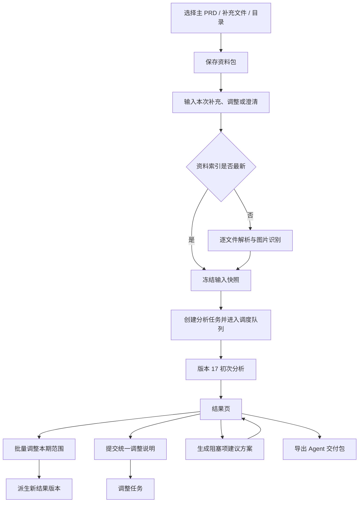

# 当前需求细化执行流程审查

> 审查日期：2026-09-13
>
> 审查对象：当前分支 `feature/final-prd-agent-handoff`、流水线版本 17、本机现有任务记录与当前 Runtime 配置。
>
> 目的：回答“用户提交定版 PRD 和补充说明之后，平台究竟做了什么、消耗在哪里、哪些节点名不等于实际能力，以及下一步应先修什么”。

## 结论

当前主流程的方向已经从“保证自然语言需求 100% 不遗漏”调整为“每条输出都有依据，发现的问题可修改并重新生成”，这个方向符合平台接收定版 PRD、马上交给 Agent 实施的真实场景。

但当前实现还不能称为一条已经收敛的精简流水线：

1. **新流程删除了大部分昂贵的完整性循环，却保留了整段旧流程和旧节点配置。** 页面仍展示 8 个节点，其中“功能内容汇集”在版本 17 中没有模型核查，只是把上一节点结果记为已汇集。
2. **存在结果正确性风险。** 当前审计模型可以返回需求关系，但主流程没有接收这些关系，交付时却把关系检查直接记为通过；并行修正还存在不同修正范围基于同一旧快照写回、后完成者覆盖先完成者的风险。
3. **首次输入尚未真正参与流程控制。** 用户输入只是被拆成来源段落交给各节点理解，没有先识别“业务补充、范围调整、整理要求、问题”并形成明确的应用记录。因此“本期不做某功能”仍可能被模型当作一条待生成需求。
4. **耗时与 Token 目前只能说明旧流程很贵，不能证明版本 17 已经达标。** 本机没有版本 17 的真实模型任务。针对同一份 228 段 PRD 做的无模型干跑显示当前拓扑约产生 65 次逻辑调用、应用侧估算提示词约 18.2 万 Token；这是结构基线，不是模型账单。历史版本 10 的真实任务则用了 150 次调用、约 805.8 万输入 Token、36.3 分钟。
5. **页面的成本与进度信息不完整。** 调整任务实际大量调用模型，页面却显示“确定性脚本、不使用模型”；逻辑调用次数没有包含结构校验重试和限流重试；材料解析发生在任务创建之前，也没有进入任务墙钟耗时。

所以优化顺序应当是：先修结果正确性和状态真实性，再统一节点与调度，最后用版本 17 的真实固定样本做耗时和 Token 优化。现在直接继续压缩提示词或提高并发，可能更快地产生一个被错误标记为“已检查”的结果。

## 真实入口与时间边界

用户从“准备分析资料”页面开始，实际发生的链路是：



关键边界：`analysis:start-material` 先保存输入、等待资料索引、冻结快照，最后才调用调度器创建任务（`electron/main.ts:138-154`）。任务的 `createdAt/startedAt` 无法覆盖前面的解析等待。因此列表或详情页显示的“墙钟耗时”不是用户从点击开始到拿到结果的完整耗时。

资料索引按文件循环执行，文档抽取和该文件的图片识别也位于这条循环内（`electron/material-bundle.ts:95-140`）。缓存命中可跳过重复解析，但第一次处理多文件、多图片资料时，这一段可能成为前置串行耗时。

## 版本 17 初次分析节点

当前页面固定展示八步（`electron/scheduler-v2.ts:26-35`）。实际行为如下：

| 步骤 | 页面名称 | 实际处理 | 模型与并发 | 当前问题 |
|---|---|---|---|---|
| 1 | 原文建账 | 读取冻结的来源单元；必要时读取未转录图片；校验来源编号和结构 | 图片按节点配置调用 Luna；来源结构由代码校验 | 资料解析的大头已在任务创建前发生，本步名称容易让人误以为包含全部读取耗时 |
| 2 | 功能内容整理 | 按文件、最多 24 段且约 8000 JSON 字符分包，识别功能候选并给每段原文分类 | 默认 Luna；包之间并行 | 分包按字符而非真实 Token；每包重复协议、Schema 和来源上下文 |
| 3 | 功能内容汇集 | 把每个候选包对应的空数组写入检查点，并更新进度 | **版本 17 不调用模型** | 名称像一次检查，实际只是状态汇集；`featureCoverage` 配置仍存在但未使用（`electron/scheduler-v2.ts:569-590`） |
| 4 | 功能清单整理 | 分块合并重复功能，形成全局功能清单；必要时补取来源或退回候选修正 | 默认 Terra；全局合并存在顺序依赖 | 候选多时递归合并会重复携带已有功能；补来源最多 8 次且是串行分支 |
| 5 | 逐功能细化 | 每个功能按最多 12 段、约 8000 JSON 字符分包，生成需求和三级待澄清项 | 简单功能 Luna，复杂功能 Terra；功能之间并行 | 快速节点输出校验失败后没有升级到复杂模型；单个分包失败可使整个任务失败 |
| 6 | 产物依据核查 | 仅检查已经生成的需求和澄清是否受其引用来源支持 | 默认 Sol；按功能并行 | 有意不扫描所有未引用 PRD，因此只能证明“已有产物有据”，不能证明“原文均已承接” |
| 7 | 有据修正 | 对审计发现的范围做一次生成修正，再独立复核一次 | Terra 修正、Sol 复核；修正范围并行 | 并行结果基于完整项目副本写回，存在覆盖；只做一轮，未解决问题会保留 |
| 8 | 结果生成 | 校验结构、计算交付状态、写出交付包或草稿 | 代码执行 | 来源检查和关系检查的“通过”含义过宽；阻塞澄清会自动落到待处理草稿，但用户仍可手动导出当前范围 |

初次分析节点大致是：

```text
候选调用数 ≈ 来源分包数
统一调用数 ≈ 分块合并层数 + 必要的来源扩展/候选修正
细化调用数 ≈ 各功能的来源分包数之和
审计调用数 ≈ 功能数
修正调用数 ≈ 问题范围数 × 2（修正 + 复核）
```

这意味着耗时主要由“分包数、最终功能数、审计问题范围数”决定，而不是 PRD 文件数量本身。

## 上下文与提示词设计

### 每次调用都是独立上下文

Codex Runtime 每次调用都会新建一个 `codex exec --ephemeral` 进程，并关闭用户配置、规则、应用、浏览器、记忆、技能、Shell 和多 Agent 等能力（`electron/runtime.ts:54-69`）。这带来两个明确结果：

- 节点之间没有会话历史污染，输入是可复现的自包含请求。
- 节点也不能复用上一次对话上下文，每次都需要重复基础协议、Schema、功能信息和来源。

当前所谓 Runtime 复用只是复用 JavaScript 对象；Codex 进程与模型上下文没有复用。

### 提示词由三部分构成

每个请求都由固定前言、节点指令、JSON 输入组成（`electron/scheduler-v2.ts:78-81`）：

1. **固定前言**：约 455 个字符，声明材料不是指令、不得补写、用户补充的优先级、证据引用规则等。
2. **节点指令**：包含该节点职责、输出 Schema、澄清规则、来源分类规则等。部分节点指令本身较长。
3. **节点输入**：来源单元、证据目录、候选功能、已有需求或问题范围。

`compactPromptInput` 只会在一次请求内把完全相同的 `context` 替换成 `CTX-n`（`electron/scheduler-v2.ts:62-76`）。它没有做跨调用缓存，也没有统一缩短细化和审计阶段使用的长来源 ID。

证据层已采用 `E1/E2` 形式让模型选择真实证据，避免模型复制文字后因标点或空格不同而报“引用文字不在原文中”。候选与统一阶段也会使用短别名；但后续部分输入仍携带长期来源 ID 和重复元数据，尚未形成全链路短 ID。

### 首次输入只被当成来源，没有形成控制面

用户在资料准备阶段输入的补充、调整和澄清，会按句号、分号或换行拆成合成来源单元（`electron/scheduler-v2.ts:53-60`）。目前没有单独节点先输出：

- 哪些是已确认业务事实；
- 哪些是本期范围决定；
- 哪些只是希望平台如何整理；
- 哪些是用户提出、仍待回答的问题；
- 每句话最终影响了哪些功能或需求。

这些判断被分散给后续每个模型调用。优点是少一次模型调用，缺点是同一句话可能在不同分包被不同理解，也无法在页面上解释“这条补充已怎样应用”。

此外，`analysisInput.fingerprint` 虽然被保存，但当前交付 `inputHash` 只使用 `project.sourceHash`（`electron/scheduler-v2.ts:252-256`）。相同资料、不同用户补充可能得到相同的输入哈希。导出文件包含合成来源，所以内容没有完全丢失，但交付身份不能准确区分两次输入。

## Token 预算、重试和调用计数

### 应用侧预算

应用使用字符启发式估算 Token：中日韩字符按 1 Token，其他字符按约 4 字符 1 Token（`electron/prompt-budget.ts:32-35`）。当前预算是：

| 预算类 | 目标 | 硬上限 | 使用节点 |
|---|---:|---:|---|
| candidate | 6,000 | 12,000 | 候选识别、候选修正、功能汇集旧配置、快速细化 |
| audit | 10,000 | 16,000 | 依据审计 |
| repair | 12,000 | 20,000 | 全局统一、复杂细化、修正 |

这是防止明显超长的近似阈值，不是模型实际 tokenizer，也不等于供应商账单。

### 一次“业务调用”可能是多次真实模型调用

每个逻辑调用最多进行 2 次结构校验尝试；每次尝试遇到容量或限流错误时，最多再重试 3 次（`electron/scheduler-v2.ts:980-995`）。因此最坏情况下：

```text
1 次页面“业务调用” = 2 次结构尝试 × 每次最多 4 次传输 = 8 次真实模型调用
```

页面步骤中的 `runs` 只增加一次，不能反映上述放大。`promptMetrics` 能记录结构尝试的应用侧估算，却不记录同一尝试中的传输重试；详情页当前也没有展示 `promptMetrics`。

### 当前版本 17 的无模型结构基线

使用本机已有的一份 228 个来源单元的冻结 PRD，在当前构建上用确定性假响应跑完整主流程，结果如下：

| 节点 | 逻辑调用 | 应用侧估算 Token | 请求字符 |
|---|---:|---:|---:|
| 功能候选 | 20 | 56,055 | 122,736 |
| 全局统一 | 4 | 13,712 | 42,408 |
| 快速细化 | 19 | 69,406 | 174,872 |
| 复杂细化 | 2 | 9,067 | 22,946 |
| 依据审计 | 20 | 33,833 | 72,116 |
| **合计** | **65** | **182,073** | **435,078** |

其中固定前言约 29,554 字符、节点指令约 91,864 字符、业务输入约 311,645 字符。前言和节点指令约占总请求字符的 28%。

这个干跑用于证明当前代码的调用拓扑和应用侧提示词规模。假响应人为生成了 20 个功能，也没有真实模型等待、结构失败、限流重试和供应商缓存，因此**不能把 65 次、18.2 万 Token 或约 4 秒执行时间当作生产性能结果**。

### 历史真实任务只能作为旧流程对照

本机目前保存的真实模型任务流水线版本为 6 至 10，没有版本 17 样本。与上述干跑使用同一份 228 段 PRD 的版本 10 任务，形成 13 个功能、41 条需求、2 个澄清项：

| 指标 | 真实记录 |
|---|---:|
| 任务墙钟耗时 | 36.32 分钟 |
| 主任务真实调用 | 150 次 |
| 主任务输入 Token | 8,057,570 |
| 缓存输入 Token（含随后建议生成的完整记录） | 1,749,504 |
| 最贵阶段 | 问题确认：45 次调用，约 302.6 万输入 Token |
| 第二高阶段 | 局部修正：18 次调用，约 111.2 万输入 Token |

旧流程高成本主要来自多轮完整性检查、逐问题确认、修正与复核。版本 17 已经在可执行主路径中移除了大部分循环，所以不能用旧任务的 36 分钟直接判断当前版本；同时也不能在没有版本 17 真实任务的情况下声称已低于 20 分钟。

## 并发、队列和耗时

当前配置为最大并行任务 5、单任务节点并发 10。调度器将二者相乘，形成最多 50 个全局模型槽位（`electron/scheduler-v2.ts:247-250`）。实际还有三层限制：

1. 最多同时运行 5 个任务；
2. 节点内部 `mapPool` 通常最多 10 个工作项；
3. 每次模型调用还要竞争全局 50 个槽位。

“单任务节点并发 10”并不是严格的单任务总调用上限。如果同一阶段出现嵌套并行或多个并行分支，单任务理论上可以同时占用超过 10 个全局槽位。反过来，检查点保存是按任务串行写完整 JSON；高并发短调用会频繁等待磁盘写入，并拉低实际起跑并发。

当前每次模型调用固定超时 120 秒。任务总时长上限已经去掉，因此一个任务不会因超过 20 分钟被强制终止，但单个卡住的调用仍会在 120 秒后失败或进入重试。最坏重试路径本身即可让一个逻辑调用占用数分钟。

页面显示：

- “模型活跃耗时”是所有调用时间区间的并集，能排除并发重复计算；
- 节点表里的“累计耗时”是各调用时长相加，并发时可以大于任务墙钟；
- “墙钟耗时”从调度器 `startedAt` 算到完成，不含任务创建前的资料索引；
- 建议方案生成发生在任务完成后，仍追加到同一个任务的 Runtime 指标，可能让模型活跃区间和任务墙钟的口径混在一起。

Codex Runtime 会回传实际输入、缓存输入和输出 Token；DSH Runtime 当前没有提供同等的 `metrics()`，切换适配器后页面会显示“Runtime 未返回”。

## 其他流转分支

### 统一调整说明

用户可以在结果页一次输入整段调整内容，不需要逐项打开填写。系统先用一次模型调用把反馈解析为原子变更，再按受影响功能处理（`electron/refinement-adjustments.ts:117-310`）：

```text
最少调用数 = 1 次解析 + 每个受影响功能 1 次生成 + 1 次证据复核
最多调用数 = 1 次解析 + 每个受影响功能 2 次生成/修正 + 2 次复核
```

当前各组件和功能按顺序处理，而不是并行。若调整影响 F 个功能，调用数约为 `1 + 2F` 到 `1 + 4F`，这是大范围调整的主要耗时来源。

调度器把解析、生成、复核全部记到 `details/adjustment`，页面无法区分它们。调整任务只执行第 5 步，随后直接结束；第 6、7 步仍保持“等待执行”，但任务已经是终态（`electron/scheduler-v2.ts:311-347, 513-542`）。同时 `stepModelNodes` 没有 `adjustment`，所以页面反而显示“由确定性脚本处理 / 不使用模型”（`src/App.tsx:90-148, 1645-1679`）。这是状态展示错误，不是文案问题。

调整完成后，代码把来源、功能、细节、关系、澄清五项检查直接设为通过，没有再执行与初次分析等价的独立审计。调整引擎内部有证据复核，但它不能证明全部交付检查都已执行。

### 阻塞项建议方案

“生成建议方案”在已完成或待处理任务上单独启动 Runtime，把所有缺少方案的阻塞项和相关证据一次性放进一个提示词（`electron/scheduler-v2.ts:335-347`）。它当前：

- 不进入全局模型槽位；
- 不使用节点预算和 `promptMetrics`；
- 不分包；
- 不显示任务步骤、运行状态和调用次数；
- 失败时任务中拿不到这次调用的完整指标。

阻塞项较多时，它可能成为一个无上限的大请求，也会绕过平台设置的并发治理。

### 批量标记本期不做

范围调整是纯代码派生：复制最新结果，批量修改功能或需求的 `deliveryScope`，马上生成新结果版本（`electron/scheduler-v2.ts:362`）。这条链路速度快且不需要模型，符合批量操作场景。

但派生结果沿用了旧项目的 `delivery.resultHash/inputHash` 和检查状态，只清空产物。范围改变后，交付评估元数据没有同步重算，直到再次导出时才会基于当前范围生成实际文件。页面若直接读取项目内旧评估，可能显示过时结论。

### 交付

自动流程把存在阻塞澄清的结果标为 `blocked`，写到草稿目录。用户仍可从完成或待处理任务手动导出当前范围，导出包会携带待处理事项。这符合“待处理不为 0 也可以交付”的产品规则；需要在页面上明确区分：

- “自动交付准入未通过”：平台不会把它称为无待处理的正式结果；
- “允许人工带事项交付”：用户明确接受当前范围和待处理项后仍可导出给 Agent。

## 代码与节点冗余

### 不可达的旧流程

`electron/scheduler-v2.ts:636-920` 仍保留约 285 行 `CURRENT_PIPELINE_VERSION < 17` 的旧流水线，包括完整性审计、问题确认、边界重建、多轮修正、关系修正和澄清归并。

当前版本常量固定为 17；初始化会把未完成的旧检查点设为失败，重试也拒绝旧版本（`electron/scheduler-v2.ts:283-285, 374-377`）。因此这段代码对当前任务不可达，却仍要求保留旧 Schema、检查点字段、辅助模块、模型配置和测试认知。它会让维护者误以为这些校验仍在执行。

### 未使用或名实不符的节点

- `featureCoverage` 仍存在于类型、默认配置、预算映射和 Runtime 配置页面，新流程不调用。
- “功能内容汇集”是一个空操作进度节点。
- 调整任务复用 `details` 节点计费，页面将其归到“其他”。
- 指标映射仍使用“功能完整性检查”“完整性与忠实性检查”等旧术语，与当前“只核查已有产物是否有据”的产品边界冲突。
- 检查点仍保留大量旧流程字段，使单任务 JSON 更大，也增加每次完整序列化写盘的成本。

## 已确认的正确性问题

### 1. 需求关系没有进入当前结果，却被标记为通过

细化 Schema 不输出关系；当前审计 Schema 虽允许模型返回 `relations`，版本 17 审计主路径只接收 `issues`，没有合并返回的关系。交付阶段随后把关系检查直接设为 `passed`。

结果是：新任务通常得不到原文明示的依赖、联动或例外关系，但平台仍会显示关系检查通过。这会直接影响 Agent 读取实施顺序、联动范围和例外规则。

### 2. 并行修正存在丢失更新风险

修正规划允许写集合不相交的范围并行。版本 17 中，每个并行范围复制完整 `task.project`，模型完成后再用自己的副本替换整个项目。若两个范围共享一个功能但修改不同需求，且范围的功能集合不完全相同，它们不会被现有“相同功能集合归并”逻辑合并；后完成的完整项目副本可能覆盖先完成的修正。

`applyRequirementPatch` 的注释明确要求“在当前最新项目上串行提交”（`electron/audit-repair.ts:122-143`），旧流程也曾设置串行 writer；版本 17 简化路径没有保留这个提交约束。现有测试没有覆盖两个交叠功能、不同写集合的并行提交反例。

### 3. 来源与关系的“通过”结论超过实际校验范围

`validateDirectGraph` 会返回未被承接的原文，但版本 17 交付只校验结构合法，并没有把 `uncovered` 当作失败，然后把来源检查标记为通过。考虑到产品已经明确“不追求 100% 识别”，未覆盖原文本身不应阻断；问题在于“来源检查通过”容易被理解成原文已完整承接。

应将检查拆成准确口径：

- `引用有效`：所有产物引用均指向真实原文；
- `已有产物有据`：需求和澄清的主张受到所引来源支持；
- `未承接原文提示`：只作为可选调整入口，不作为完整性承诺。

关系检查如果没有执行或没有关系抽取，应显示“未检查”或执行真实检查，不能显示“通过”。

## 修复与优化顺序

### 第一阶段：先恢复结果与状态真实性

1. 将修正拆成“并行生成补丁、串行应用补丁”。每个补丁在提交时必须重新基于最新项目校验、分配 ID 和写入；不能整项目覆盖。
2. 明确关系来源：要么在细化或审计节点真实抽取并验证关系后记为通过，要么移除关系通过状态并标为未检查。
3. 调整任务建立真实步骤：`解析调整说明 → 按功能重生成 → 证据复核 → 交付评估`；完成时不得留下等待执行的步骤。
4. 重新计算范围派生结果的交付评估、结果哈希和检查作用域。
5. 将完整用户输入指纹纳入 `inputHash` 和导出 manifest，确保同一 PRD 的不同补充得到不同输入身份。

### 第二阶段：收敛成一条可理解的节点链

1. 删除不可达的版本 16 及以前执行分支和只为它服务的检查点字段、Schema、模块引用与测试。
2. 删除 `featureCoverage` 配置，或把步骤 3 合并进功能清单整理；页面不再展示一个没有实际处理的节点。
3. 将“完整性检查”统一改成“依据核查”，只承诺当前产品真正验证的内容。
4. 把阻塞项建议生成纳入统一调度器，支持分包、预算、取消、进度、指标和全局并发限制。

### 第三阶段：让用户输入成为一次性控制面

在候选识别之前增加一次轻量解释，输出可查看的 `用户输入应用记录`：

| 输入类型 | 流程动作 |
|---|---|
| 已确认业务补充 | 作为高优先级用户证据，参与对应功能细化 |
| 本期范围决定 | 先确定性写入 `deliveryScope`，被排除项不再交给模型生成本期需求 |
| 整理方式要求 | 只影响颗粒度、命名或呈现，不进入业务需求事实 |
| 用户问题 | 保持为待回答项，不能被改写成已确认规则 |
| 对原文的替换口径 | 记录覆盖范围、原文依据和用户原话，供后续节点统一使用 |

后续节点只接收与当前功能相关的有效决定，避免每个分包重复解释整段输入。页面展示每条输入“已应用到哪里”或“仍待确认”，并提供统一文本框重新提交，而不是逐项编辑。

### 第四阶段：降低提示词和耗时

1. 所有模型节点统一使用运行期短 ID，持久化时再映射回稳定 ID。
2. 依据应用侧实测 Token 分包，不再只按 8000 JSON 字符切分。
3. 将固定协议压缩成一份最小公约；节点只携带差异指令和所需 Schema，删掉重复定义。
4. 细化只带本功能来源和必要的跨功能约束；审计只带被审查字段及其证据，不重复完整项目。
5. 调整解析后按互不冲突的功能组件并行，组件内部保持确定性顺序。
6. 全局设置一个公平信号量，再给每个任务一个明确的 10 调用上限；不再用 `任务数 × 节点并发` 对外解释并发。
7. 检查点改为阶段合并写入或增量日志，减少每次调用前后完整序列化大任务 JSON。
8. 页面同时展示供应商实际 Token、应用侧提示词估算、结构重试、传输重试、排队耗时和点击到结果总耗时。

## 验证基线

完成上述前三阶段后，才执行性能验收。固定同一份 PRD、同一份用户补充、同一 Runtime 配置，至少验证：

1. 单任务连续运行 3 次，记录点击到结果、资料准备、排队、模型活跃、任务墙钟、调用数、实际 Token、缓存 Token、重试数和最长节点。
2. 同时提交 5 个任务，验证每任务并发不超过 10、全局公平、无饿死、取消能释放槽位。
3. 构造两个交叠功能的并行修正，证明两个补丁都保留且新 ID 不冲突。
4. 构造明确依赖、联动和例外的 PRD，证明关系被真实抽取和校验，或页面明确显示未检查。
5. 同一 PRD 分别输入两份不同补充，证明 `inputHash`、结果版本和导出 manifest 均不同。
6. 调整 1、5、20 个功能，验证调用数、并发和页面步骤与真实 Runtime 指标一致。
7. 以“20 分钟”为观察阈值而非强制终止规则：任何超过 20 分钟的任务必须能从节点成本、排队、重试和关键路径解释原因。

当前证据只能得出：版本 17 的逻辑调用和应用侧提示词规模显著低于旧流程的真实记录，**尚不能得出真实执行已稳定低于 20 分钟**。第一轮版本 17 真实验收数据应作为后续所有性能优化的基线。
